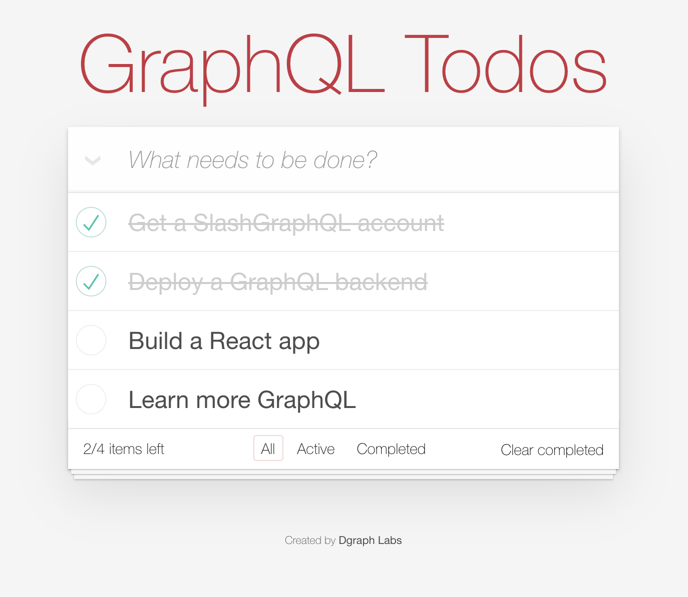

# Todo React App powered by Slash GraphQL

Todo React App using GraphQL build by Dgraph Labs and powered by [Slash GraphQL](https://dgraph.io/slash-graphql).



Check out this blog post (coming soon) to learn more about getting started with Slash GraphQL, or head over to our [docs](https://graphql.dgraph.io/) to get started.

## Starting the App

```
npm install
npm start
```

You'll first need to set the url in `src/index.js` to the Slash GraphQL backend that you deploy.  See the instructions in the blog to get started.
